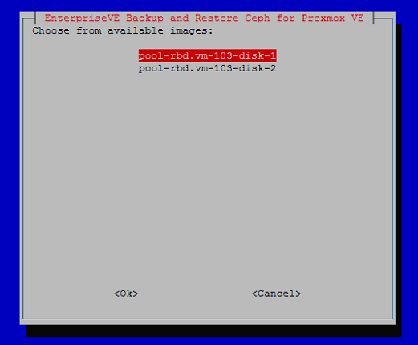
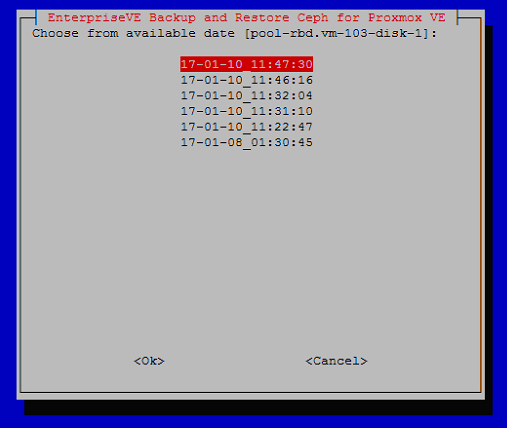
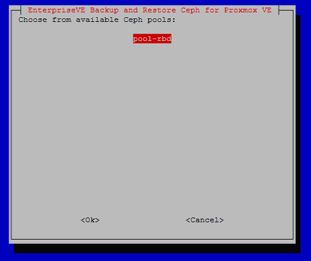
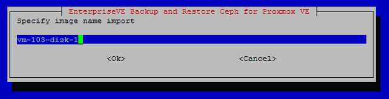
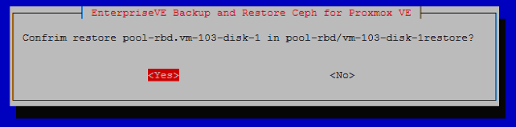
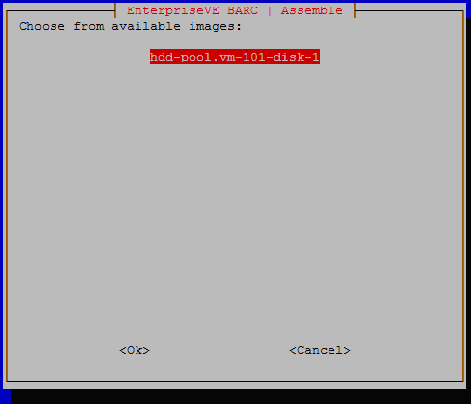
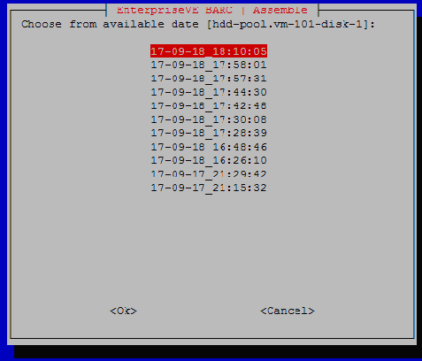
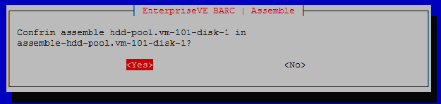

# eve4pve-barc

[](https://www.gnu.org/licenses/gpl-3.0.en.html)
[](https://gitter.im/EnterpriseVE/eve4pve-barc)
[](https://github.com/EnterpriseVE/eve4pve-barc/releases/latest)

Backup And Restore Ceph for Proxmox VE

Ceph Documentation

[Incremental snapshots with rbd](http://ceph.com/dev-notes/incremental-snapshots-with-rbd/)

[rdb – manage rados block device (rbd) images](http://docs.ceph.com/docs/master/man/8/rbd/)

```text
    ______      __                       _              _    ________
   / ____/___  / /____  _________  _____(_)_______     | |  / / ____/
  / __/ / __ \/ __/ _ \/ ___/ __ \/ ___/ / ___/ _ \    | | / / __/
 / /___/ / / / /_/  __/ /  / /_/ / /  / (__  )  __/    | |/ / /___
/_____/_/ /_/\__/\___/_/  / .___/_/  /_/____/\___/     |___/_____/
                         /_/

EnterpriseVE Backup And Restore Ceph for Proxmox VE  (Made in Italy)

Usage:
    eve4pve-barc <COMMAND> [ARGS] [OPTIONS]
    eve4pve-barc help
    eve4pve-barc version

    eve4pve-barc create   --vmid=<string> --label=<string> --path=<string> --keep=<integer>
                          --script=<string> --mail=<string> --unprotect-snap --syslog
    eve4pve-barc destroy  --vmid=<string> --label=<string> --path=<string>
    eve4pve-barc enable   --vmid=<string> --label=<string> --path=<string>
    eve4pve-barc disable  --vmid=<string> --label=<string> --path=<string>

    eve4pve-barc backup   --vmid=<string> --label=<string> --path=<string> --keep=<integer>
                          --script=<string> --mail=<string> --unprotect-snap --syslog
    eve4pve-barc restore  --vmid=<string> --label=<string> --path=<string>
                          --script=<string> --syslog

    eve4pve-barc status   --vmid=<string> --label=<string> --path=<string>
    eve4pve-barc clean    --vmid=<string> --label=<string> --path=<string> --keep=<integer>
    eve4pve-barc reset    --vmid=<string> --label=<string>
    eve4pve-barc assemble --vmid=<string> --label=<string> --path=<string>
                          --script=<string>
Commands:
    version              Show version program
    help                 Show help program
    create               Create backup job from scheduler
    destroy              Remove backup job from scheduler
    enable               Enable backup job from scheduler
    disable              Disable backup job from scheduler
    status               Get list of all backups
    clean                Clear all backup
    reset                Remove all snapshots on images specific VM/CT in Ceph
    backup               Will backup one time
    restore              Will restore image one time
    assemble             Assemble a unique image with diff file. (Require eve4ceph-mdti)

Options:
    --vmid               The ID of the VM/CT, comma separated (es. 100,101,102),
                         'all-???' for all known guest systems in specific host (es. all-pve1, all-$(hostname)),
                         'all' for all known guest systems in cluster,
                         'storage-???' storage Proxmox VE (pool Ceph) 
    --label              Is usually 'hourly', 'daily', 'weekly', or 'monthly'
    --path               Path destination backup
    --keep               Specify the number of backup which should will keep, Default 1 (can't be used with --renew)
    --cksum              Store checksums for snapshot validation (default: true)
    --iothreads          Specify number of IO threads for exporting (default: 10)
    --renew              Specify the number of incrementals backups store, until a full export is done again (can't be used with --keep)
    --script             Use specified hook script
                         E.g. /usr/share/doc/eve4pve-barc/examples/script-hook.sh
    --syslog             Write messages into the system log
    --mail               Email addresses send log backup, comma separated (es. info@domain.ltd,info1@domain.ltd)
    --unprotect-snap     Disable protection snapshot, default is protected.
                         In Proxmox VE 'protected snapshot' cause problem in remove VM/CT see documentation.

Report bugs to <support@enterpriseve.com>
```

## Introduction

Backup And Restore Ceph for Proxmox VE with retention. This solution implements
a snapshotbackup for Ceph cluster exporting to specific directory. The mechanism using
Ceph snapshot, export and export differential. In backup export image and config
file VM/CT.

For _continuous data protection_ see
[eve4pve-autosnap](https://github.com/EnterpriseVE/eve4pve-autosnap)

## Main features

* For KVM and LXC
* Can keep multiple backup
* Can obey a renew policy: (eg. 1 full exports, then 6 incremental exports)
* Supports checksumming
* Syslog integration
* Multiple schedule VM/CT using --label (es. daily,monthly)
* Hook script
* Multiple VM/CT single execution
* Copy config and firewall files
* Export any VM/CT in cluster 'all'
* Export any VM/CT in specific host 'all-hostname'
* Export any VM/CT in specific pool
* Show size of backup and incremental
* Check 'No backup' flag in disk configuration
* Protected/unprotected snap mode
* Notification via email
* Assemble image from diff require
  [eve4ceph-mdti](https://github.com/EnterpriseVE/eve4ceph-mdti)

## Protected / unprotected snapshot

During backup snapshot is created in protected mode, to avoid accidental
deletion. In Proxom VE remove VM not possible with error "Removing all
snapshots: 0% complete...failed". The problem is **Proxmox VE unprotect only the
snapshos it knows**.

Whit parameter **--unprotect-snap** is possible to disable snapshot protection.

## Configuration and use

Download package eve4pve-barc\_?.?.?-?\_all.deb, on your Proxmox VE host and
install:

```sh
wget https://github.com/EnterpriseVE/eve4pve-barc/releases/download/?.?.?/eve4pve-barc_?.?.?_all.deb
dpkg -i eve4pve-barc_?.?.?-?_all.deb
```

This tool need basically no configuration.

## Backup a VM/CT one time

```sh
root@pve1:~# eve4pve-barc backup --vmid=111 --label='daily' --path=/mnt/bckceph --keep=2
```

This command backup VM/CT 111. The --keep tells that it should be kept 2 backup, if
there are more than 2 backup, the 3 one will be erased (sorted by creation
time).

## Create a recurring backup job

```sh
root@pve1:~# eve4pve-barc create --vmid=111 --label='daily' --path=/mnt/bckceph --keep=5
```

## Delete a recurring backup job

```sh
root@pve1:~# eve4pve-barc destroy --vmid=111 --label='daily' --path=/mnt/bckceph --keep=5
```

## Pause a backup job

```sh
root@pve1:~# eve4pve-barc disable --vmid=111 --label='daily'
```

## Reactivate a backup job

```sh
root@pve1:~# eve4pve-barc enable --vmid=111 --label='daily'
```

## Status

Show status backup in directory destination.

```sh
root@pve1:~# eve4pve-barc status --vmid=111,112 --label='daily' --path=/mnt/bckceph

VM  TYPE SIZE   BACKUP            IMAGE
111 img    4.8G 17-02-08 11:08:21 pool-rbd.vm-111-disk-1
111 diff   9.3M 17-02-08 17:22:54 pool-rbd.vm-111-disk-1
111 diff   4.5K 17-02-08 17:26:42 pool-rbd.vm-111-disk-1
111 diff   4.5K 17-02-08 17:27:33 pool-rbd.vm-111-disk-1
111 img     512 17-02-08 11:08:21 pool-rbd.vm-111-disk-2
111 diff   4.5K 17-02-08 17:22:54 pool-rbd.vm-111-disk-2
111 diff   4.5K 17-02-08 17:26:42 pool-rbd.vm-111-disk-2
111 diff   4.5K 17-02-08 17:27:33 pool-rbd.vm-111-disk-2
111 img     512 17-02-08 11:08:21 pool-rbd.vm-111-disk-3
111 diff   4.5K 17-02-08 17:22:54 pool-rbd.vm-111-disk-3
111 diff   4.5K 17-02-08 17:26:42 pool-rbd.vm-111-disk-3
111 diff   4.5K 17-02-08 17:27:33 pool-rbd.vm-111-disk-3
112 img     10G 17-02-08 17:22:54 pool-rbd.vm-112-disk-1
112 diff   7.4M 17-02-08 17:26:42 pool-rbd.vm-112-disk-1
112 diff   1.9M 17-02-08 17:27:33 pool-rbd.vm-112-disk-1
```

## Restore a VM/CT one time

```sh
root@pve1:~# eve4pve-barc restore --vmid=111 --label='daily' --path=/mnt/bckceph
```

This command restore single image.

### Select image restore



### Select time restore



### Select pool destination



### Input name image destination



### Confirm restore



### Process output restore

```sh
Start restore process
Inital import 170108013045.pool-rbd.vm-111-disk-1.img
Importing image: 100% complete...done.
Differential /mnt/bckceph/barc/111/daily/170110112247.pool-rbd.vm-111-disk-1.diff
Importing image diff: 100% complete...done.
Differential /mnt/bckceph/barc/111/daily/170110113110.pool-rbd.vm-111-disk-1.diff
Importing image diff: 100% complete...done.
Differential /mnt/bckceph/barc/111/daily/170110113204.pool-rbd.vm-111-disk-1.diff
Importing image diff: 100% complete...done.
Differential /mnt/bckceph/barc/111/daily/170110114616.pool-rbd.vm-111-disk-1.diff
Importing image diff: 100% complete...done.
Differential /mnt/bckceph/barc/111/daily/170110114730.pool-rbd.vm-111-disk-1.diff
Importing image diff: 100% complete...done.
Removing all snapshots: 100% complete...done.
Backup pool-rbd.vm-111-disk-1 restored in pool-rbd/vm-111-disk-1-restored with success!
Consider to manually create VM/CT and change config file from backup adapting restored image.
```

## Assemble make a unique image with diff file

```sh
root@pve1:~# eve4pve-barc assemble --vmid=111 --label='daily' --path=/mnt/bckceph
```

### Select image



### Select time



### Confim assemble



```sh
Start assemble process
Copy image to '/mnt/bckceph/barc/111/daily/assemble-hdd-pool.vm-111-disk-1'
Assemble /mnt/bckceph/barc/111/daily/170917212942hdd-pool.vm-111-disk-1.diff
Reading metadata
From snap: barcdaily170917211532
To snap: barcdaily170917212942
Image size: 107374182400 (100GB)
End of metadata
End of data
Writing 22540800 bytes to image
Assemble /mnt/bckceph/barc/111/daily/170918162610hdd-pool.vm-111-disk-1.diff
Reading metadata
From snap: barcdaily170917212942
To snap: barcdaily170918162610
Image size: 107374182400 (100GB)
End of metadata
End of data
Writing 237973504 bytes to image
Assemble /mnt/bckceph/barc/111/daily/170918164846hdd-pool.vm-111-disk-1.diff
Reading metadata
From snap: barcdaily170918162610
To snap: barcdaily170918164846
Image size: 107374182400 (100GB)
End of metadata
End of data
Writing 35502592 bytes to image
Assemble /mnt/bckceph/barc/111/daily/170918172839hdd-pool.vm-111-disk-1.diff
Reading metadata
From snap: barcdaily170918164846
To snap: barcdaily170918172839
Image size: 107374182400 (100GB)
End of metadata
End of data
Writing 89499136 bytes to image
Assemble /mnt/bckceph/barc/111/daily/170918173008hdd-pool.vm-111-disk-1.diff
Reading metadata
From snap: barcdaily170918172839
To snap: barcdaily170918173008
Image size: 107374182400 (100GB)
End of metadata
End of data
Writing 2568192 bytes to image
Assemble /mnt/bckceph/barc/111/daily/170918174248hdd-pool.vm-111-disk-1.diff
Reading metadata
From snap: barcdaily170918173008
To snap: barcdaily170918174248
Image size: 107374182400 (100GB)
End of metadata
End of data
Writing 18404864 bytes to image
Assemble /mnt/bckceph/barc/111/daily/170918174430hdd-pool.vm-111-disk-1.diff
Reading metadata
From snap: barcdaily170918174248
To snap: barcdaily170918174430
Image size: 107374182400 (100GB)
End of metadata
End of data
Writing 2912256 bytes to image
Assemble /mnt/bckceph/barc/111/daily/170918175731hdd-pool.vm-111-disk-1.diff
Reading metadata
From snap: barcdaily170918174430
To snap: barcdaily170918175731
Image size: 107374182400 (100GB)
End of metadata
End of data
Writing 38584320 bytes to image
Assemble /mnt/bckceph/barc/111/daily/170918175801hdd-pool.vm-111-disk-1.diff
Reading metadata
From snap: barcdaily170918175731
To snap: barcdaily170918175801
Image size: 107374182400 (100GB)
End of metadata
End of data
Writing 1202176 bytes to image
Assemble /mnt/bckceph/barc/111/daily/170918181005hdd-pool.vm-111-disk-1.diff
Reading metadata
From snap: barcdaily170918175801
To snap: barcdaily170918181005
Image size: 107374182400 (100GB)
End of metadata
End of data
Writing 29091840 bytes to image
Backup hdd-pool.vm-111-disk-1 assebled in assemble-hdd-pool.vm-111-disk-1 with success!
```

Mount image. For NTFS using offset 1048576

```sh
mount -o loop,offset=1048576 assemble-hdd-pool.vm-11-disk-1.assimg /mnt/imgbck/
```

## Changing parameters

You can edit the configuration in /etc/cron.d/eve4pve-barc or destroy the job
and create it new.
